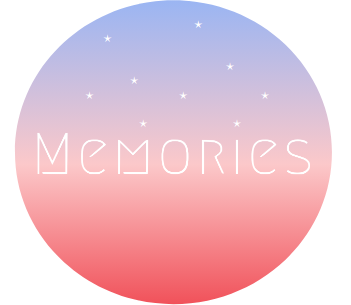
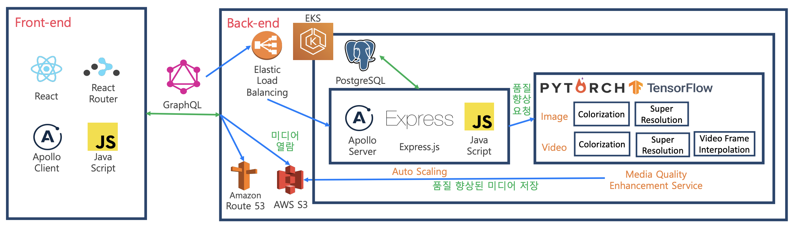

# Memories  

## 1. 프로젝트 소개
[share-memories.ml](http://share-memories.ml/)




**"내가 추억하는 그 때 그곳을 다시 생생하게 볼 수 있을까?"**

 사람들은 여행, 우정, 기념일, 음식 등 일상을 간직해 놓기 위해 영상을 촬영한다. 기술이 발전하면서 1억 화소가 넘는 초고해상도 촬영이 가능해졌을 뿐만 아니라 고주사율(120fps, 144fps, …), 초고해상도(4k, 8k) 디스플레이가 등장하였다. 그 당시 최신 기술로 촬영되었던 20세기 영상들은 지금의 기준으로는 저품질(흑백, 저해상도, 저주사율, 노이즈, …)로써 존재한다. 역동적으로 나아가는 기술의 발전 속도를 기존의 영상, 미디어들이 따라가지 못하고 있는 상황에서 소비자들은 개개인이 가지고 있는 추억을 다시 꺼내보고 싶어 한다. 그중 일부는 추억하는 장소로 찾아가 보지만, 살던 곳이 재개발되거나, 기존의 건물 대신 다른 건물이 세워져 원래의 모습을 찾아볼 수 없는 때도 있다.

 “현재 시대는 정보화 사회에서 정보, 재화를 공유하는 공유 사회로 넘어가고 있다” 한계비용제로사회에서 언급한 제레미 리프킨의 말이다. SNS상에서 지인들에게 정보를 공유하며 살아가는 것이 익숙한 현대인들에게 본 프로젝트는 서로의 추억을 공유하며 볼 수 있는 플랫폼을 제공해주고자 한다. 사용자는 우리의 플랫폼을 이용해 자신이 다시 보고 싶은 그 시절 그 장소를 검색해 생생한 화질의 영상들을 보며 추억을 되살릴 수 있다. 또한, 함께 공유하고 싶은 풍경이나 물건 등의 영상이 있다면 플랫폼에 업로드하여 향상된 품질로 모든 사용자가 다 같이 볼 수 있게끔 할 수 있다.


## 2. Abstract

"Can I vividly see the old place I remember again?"

People film videos to keep their daily lives such as travel, friendship, anniversaries, and food. With the advancement of technology, not only has it been possible to shoot ultra-high resolutions of over 100 million pixels, but also high-resolution (120fps, 144fps,…) and ultra-high-resolution (4k, 8k) displays have appeared. Now, the 20th century pictures that were filmed with the latest technology at that time exist as low quality (black and white, low resolution, low frame rate, noise, ...) as the current standard. In the situation where existing media are not keeping pace with the development speed of dynamic technology, consumers want to bring back memories of each individual. Some of them go to places of remembrance, but there are times when the place where you lived was redeveloped.

“The current era is shifting from an information society to a sharing society that shares information and goods,” said Jeremy Rifkin, referring to the zero marginal society. Modern people who are accustomed to living by sharing information with friends on SNS
This project aims to provide a platform for people to share and view each other's memories. Users can use our platform to search for the place in those days when they want to see it again, and watch the videos with vivid media quality to bring back memories. In addition, if there are videos of scenery or objects that you want to share together, you can upload them to the platform so that all users can see them together with improved quality.


## 3. 기술 설명




## 4. 소개 영상 & 시연 영상

소개: https://www.youtube.com/watch?v=lXbIrGTT7Ps

시연: https://youtu.be/oXESAG_IX-M


## 5. 팀 소개

* 김병조  

```
역할 : Leader, Super Resolution Model, Front end 개발 
E-mail : gee05053@gmail.com
```

* 곽윤혁  

```
역할 : Software Project Leader, Frame Interpolation Model, Back end 개발 
E-mail : rev1c0sm0s@gmail.com
```

* 이혜진  

```
역할 : Colorization Model, Front end 개발 
E-mail : dgw0913@gamil.com
```

* 김수진  

```
역할 : Colorization Model, Front end 개발 
E-mail : agatha197@kookmin.ac.kr
```

* 권우철  

```
역할 : Front end 개발, 데이터 수집 
E-mail : dncjf0223@kookmin.ac.kr
```


## 6. 사용법

홈페이지

회원가입 & 로그인 (선택)

```
1. 홈페이지에서 상단에 로그인 버튼 클릭
2. 계정이 있으면 로그인, 계정이 없으면 회원가입 진행
```

검색 & 미디어 감상

```
1. 검색하고 싶은 미디어의 제목, 장소, 년도를 입력하여 검색
2. 검색된 결과로 나온 여러 카드 중 감상하고 싶은 미디어 하나 클릭
3. 감상
4. 로그인을 했을 경우 댓글을 작성 가능
```

업로드 (로그인 필요)

```
1. 로그인
2. 상단에 업로드 버튼 클릭
3. 업로드할 미디어(영상, 사진) 선택
4. 제목, 지역, 카테고리, 년도, 설명을 입력
5. Submit 버튼을 클릭하여 변환 시작
```

내가 올린 미디어 (로그인 필요)

```
1. 로그인
2. 업로드 버튼 옆에 있는 Avatar를 클릭
3. 내 앨범 클릭
4. 내가 올린 미디어 감상
```

올린 미디어 수정 (로그인 필요)

```
1. 자신이 업로드한 미디어 감상 화면으로 이동
2. Modify 버튼을 눌러 제목, 지역, 카테고리, 년도, 설명을 수정
3. Submit 버튼 클릭 
```


## 7. 변환 결과
Home Page


---

 

 

 
